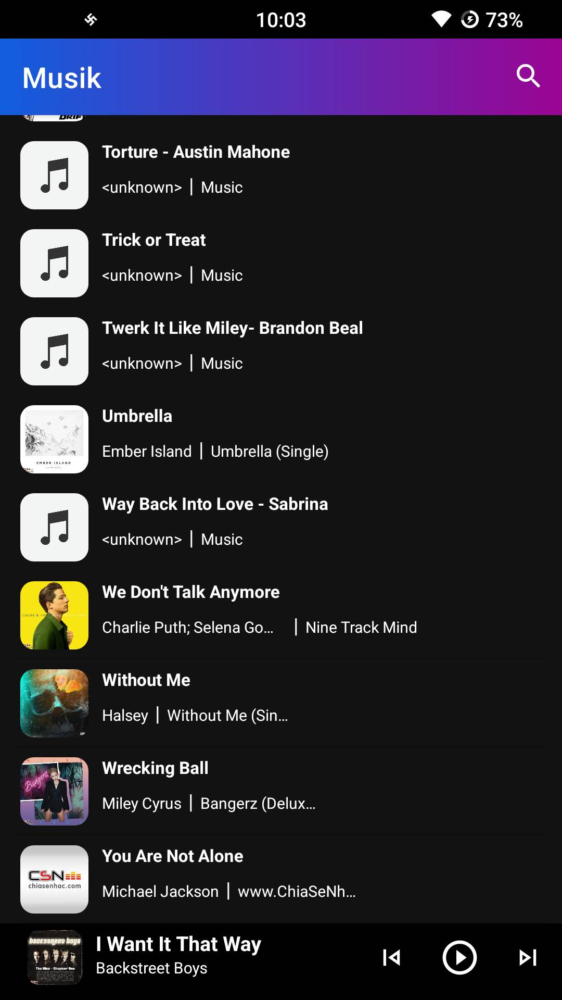

<h1 align="center">Musik - Unity in Diversity 
    A music player application for AndroidOS devices
</h1>

    

# [**Table Of Content**](#table-of-content)
- [**Table Of Content**](#table-of-content)
- [**Introduction**](#introduction)
- [**Features**](#features)
  - [**Icon Launcher**](#icon-launcher)
  - [**Slash Screen**](#slash-screen)
  - [**Home**](#home)
  - [**Search**](#search)
  - [**Compact Media Control**](#compact-media-control)
  - [**Default Media Control**](#default-media-control)
  - [**Notification Media Control**](#notification-media-control)
- [**Made with 💘 and Kotlin**](#made-with--and-kotlin)

# [**Introduction**](#introduction)

You are using rooted devices or using customized ROM from popular programming forums like XDA, StackOverflow,... and your ROM does not have a music player 🤪🤪. You come right place. This application is for you.

The application is called **Musik** with its slogan is **Unity in Diversity**. Because music is the common language that every racial, every generation, every one speaks different languages, can understand.

# [**Features**](#features)

I am a newcomer with Kotlin so that the application just have a basic functions as I lists the following:

## [**Icon Launcher**](#icon-launcher)

    

<h3 align="center">

***Icon Launcher***
</h3>

## [**Slash Screen**](#slash-screen)

    

<h3 align="center">

***The first screen you look when open the application***
</h3>

## [**Home**](#home)

    

<h3 align="center">

***Icon Launcher***
</h3>
Home page includes three important parts, they are:

1. App bar which have search button and application name

2. List of Songs which you can scroll up or scroll down to select your music

3. Compact Media Control which provides you some necessary buttons to play your music
   
## [**Search**](#search)

Search is a useful function if you have almost 400 songs in smartphone as I have🤣🤣🤣. The function can help you to find song by 
enter your keyword that you want.

The function supports 2 options to find songs:

1. Enter your favorite song's name

2. Enter your favorite artist

    
    

<h3 align="center">

***Search feature supports 2 ways to find songs: by name or by artist***
</h3>

## [**Compact Media Control**](#compact-media-control)

Compact media control is one of three ways that I provides to play songs in **Musik**. From my point of view, this is the best convenient way. You can play/ pause, skip next & skip previous the current song easily.

    

<h3 align="center">

***This is the best convenient way to play music 💃💃***
</h3>

## [**Default Media Control**](#default-media-control)

Default media control is the soul of music application. And **Musik** is not an exception. I designed 
this layout by my own with all buttons I think everyone needs when playing music.

    

<h3 align="center">

***Musik provides 6 main components to play music 💃💃***
</h3>

There are 6 main components in this media control:

1. Seek Bar: you can swipe left or swipe right to play song as you want.

2. Repeat mode: button helps you set your loop: loop all, loop only one & single loop

3. Shuffle: button helps you shuffle your list of songs

4. Play/Pause: play or pause the current song which is being playing

5. Skip Next/ Skip Previous: go forward or go backward one of the songs

## [**Notification Media Control**](#notification-media-control)

Finally, **Musik** supports your music experience in the next level: immerse yourself in music right now from Lock-screen or notification system bar.

    

<h3 align="center">

***Notification media control in compact format 💿***
</h3>

As you click on notification, media control transform to its default format with 3 basic buttons: play/ pause, skip next & skip previous

    

<h3 align="center">

***Notification media control in default format 💿***
</h3>

# [**Made with 💘 and Kotlin**](#made-with-love-and-kotlin)